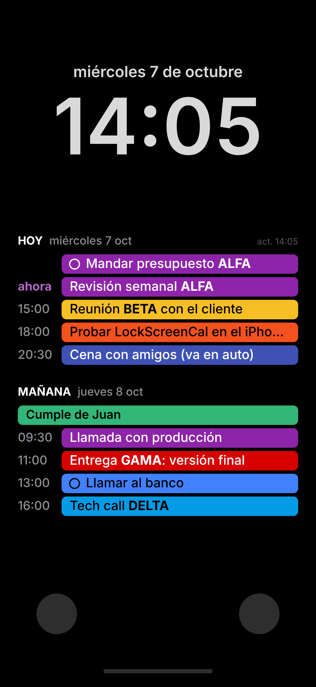

# LockScreenCal

Tu calendario de los próximos días en el lock screen del iPhone, con colores y
fondo negro. No es una app del App Store: es un Atajo más la app gratis
[Scriptable](https://apps.apple.com/app/scriptable/id1405459188), que dibuja el
fondo de pantalla con tus eventos.



(Datos de ejemplo. El reloj y los botones los pone el iPhone.)

- Muestra hoy, mañana y los días que sigan, **hasta donde entre**. Los días sin
  eventos no ocupan lugar.
- Cada evento lleva el color de su calendario, y las palabras que elijas (por
  ejemplo, nombres de proyectos) se pintan de su color en el título.
- Todo corre en tu teléfono: tus eventos no pasan por ningún servidor.
- Se actualiza solo: cada mejora del código llega sin reinstalar nada.

¿Por qué un fondo y no un widget? En el lock screen, iOS muestra los widgets en
blanco y negro. La única forma de tener colores es el fondo de pantalla.

---

## Instalar (5 minutos)

1. Instalá **[Scriptable](https://apps.apple.com/app/scriptable/id1405459188)** y
   abrila una vez.
2. Abrí el link del Atajo: **LINK_DEL_ATAJO** → **Agregar atajo**.
3. En **Atajos**, tocá **Actualizar calendario**. La primera vez pide acceso al
   calendario y a cambiar el fondo: aceptá todo. Bloqueá el teléfono y fijate.

> Tus eventos de Google aparecen si la cuenta está agregada en **Ajustes → Apps →
> Calendario → Cuentas**.

### Que se actualice solo

iOS no deja compartir automatizaciones, así que esta parte la hace cada uno, una vez:

1. **Atajos** → pestaña **Automatización** → **+** → **Hora del día**.
2. Elegí la hora (ej. 7:00), **Diariamente**, y marcá **Ejecutar inmediatamente**.
3. **Siguiente** → elegí **Actualizar calendario**.

Repetilo para las horas que quieras (ej. 7, 12, 17). Si querés que se actualice
cada vez que tocás algo en el calendario, sumá otra: **App** → **Calendario** →
**Se cierra** → **Ejecutar inmediatamente** → **Actualizar calendario**.

Arriba a la derecha del fondo dice `act. HH:MM`: la hora de la última actualización.

### Si ya usás otra app de calendario en el lock screen (Ink, etc.)

Las dos cambian el fondo y gana la última que corrió. Para tener las dos, armá un
lock screen aparte: mantené apretado el lock screen → **+** → **Color** → negro.
Cuando el Atajo cambia el fondo, cambia el que estés usando en ese momento.

---

## Ajustes

Abrí **Atajos**, mantené apretado **Actualizar calendario** → **Editar**. En la
primera acción (el código) está `MI_CONFIG`. Por ejemplo:

```js
const MI_CONFIG = {
  keywords: { ALFA: "#8E24AA", BETA: "#F6BF26" },
  excludeCalendars: ["Holidays in Argentina"],
};
```

| Opción | Para qué |
|---|---|
| `keywords` | Palabras que se pintan de color en los títulos. Distingue mayúsculas y solo toma palabras enteras ("VA" sí, "va" no) |
| `excludeCalendars` | Calendarios a ignorar, con el nombre tal cual aparece en la app Calendario |
| `onlyCalendars` | Si tiene nombres, solo esos calendarios |
| `maxDays` | Hasta cuántos días adelante mirar (se dibuja lo que entre). Por defecto 14 |
| `topPercent` / `bottomPercent` | Espacio libre arriba (reloj, widgets) y abajo (linterna, cámara), en % del alto. Por defecto 33 y 13 |
| `background`, `textColor`, `mutedColor` | Colores |
| `showUpdated` | Mostrar `act. HH:MM` |
| `googleUrl` | Colores de Google por evento (ver abajo) |

Si un mismo evento viene de dos calendarios (pasa con los feriados), se muestra una sola vez.

## Colores de Google por evento (opcional)

El iPhone sabe el color de cada **calendario**, pero no el color que le ponés a
cada **evento** en Google Calendar. Si pintás eventos a mano en Google y querés
ver esos colores, hay un puente chiquito que corre en tu cuenta de Google
(Google Apps Script, gratis). Conviene hacerlo desde la compu:

1. Entrá a <https://script.google.com> con la cuenta del calendario → **Nuevo proyecto**.
2. Borrá lo que hay y pegá [`google/Code.gs`](google/Code.gs).
3. Cambiá `TOKEN` por algo largo y al azar (es la "contraseña" de la URL).
4. **Configuración del proyecto** (engranaje) → zona horaria: la tuya.
5. **Implementar → Nueva implementación** → **App web**: ejecutar como **Yo**,
   acceso **Cualquier usuario**. Autorizá los permisos de Calendar.
6. Copiá la URL que termina en `/exec` y agregala en `MI_CONFIG`:
   ```js
   googleUrl: "https://script.google.com/macros/s/XXXX/exec?token=TU_TOKEN",
   ```

Los calendarios que Google no tiene (por ejemplo, los cumpleaños de los contactos
del iPhone) se siguen leyendo del iPhone. Si Google no responde, usa todo del iPhone
y al lado de la hora dice `sin Google`. Si en el paso 5 no aparece "Cualquier usuario", la cuenta es de una
empresa (Google Workspace) que lo tiene bloqueado: se habilita en la consola de admin.

---

## Cómo está hecho

| Archivo | Qué es |
|---|---|
| `LockScreenCal.js` | El script: lee los eventos, dibuja la imagen y se la pasa a Atajos |
| `loader.js` | Lo que va adentro del Atajo: baja `LockScreenCal.js` de este repo y lo corre con tu `MI_CONFIG`. Sin internet, usa la última copia |
| `google/Code.gs` | El puente opcional con Google Calendar |
| `tools/preview.cjs` | Vista previa en la compu, con datos de ejemplo |
| `docs/Bitacora.md` | Estado del proyecto: qué está probado, qué falta y decisiones tomadas |
| `CLAUDE.md` | Instrucciones para agentes de IA que trabajen en el repo |

### Armar el Atajo (lo hace una vez el que lo mantiene)

En **Atajos** → **+**. Para agregar cada acción, escribí la palabra en la barra
**Buscar acciones**:

1. Buscá **Scriptable** → **Run Inline Script**. Borrá el código de ejemplo y pegá
   [`loader.js`](loader.js). "Run In App" apagado.
2. Buscá **Base64** → la acción de Base64, cambiada a modo **decodificar**, con el
   resultado del script como entrada. (Scriptable no le puede pasar una imagen a
   Atajos: se la pasa como texto y acá vuelve a ser imagen.)
3. Buscá **fondo** → la acción que pone un fondo de pantalla (no "cambiar entre
   fondos"), con el resultado de Base64 como imagen, **solo pantalla bloqueada**, y
   sin vista previa ni recorte.
4. Nombre: **Actualizar calendario**.

Los nombres exactos de las acciones y sus opciones cambian según la versión de iOS:
por eso acá van las palabras para buscarlas y no los textos de los botones.

Para compartirlo: mantené apretado el Atajo → **Compartir** → **Copiar enlace de
iCloud**. El link es una foto del Atajo en ese momento: conviene compartirlo con
`MI_CONFIG` vacío y recién después personalizar el propio.

### Vista previa en la compu

```sh
npm i playwright && npx playwright install chromium
node tools/preview.cjs          # -> preview/preview.png
```
